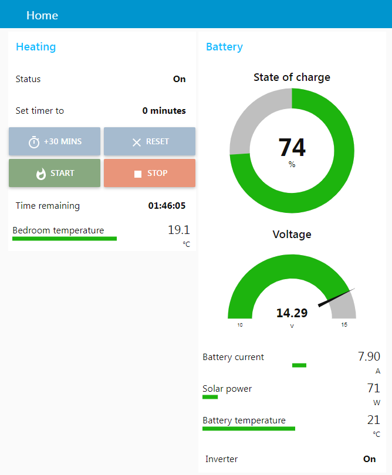
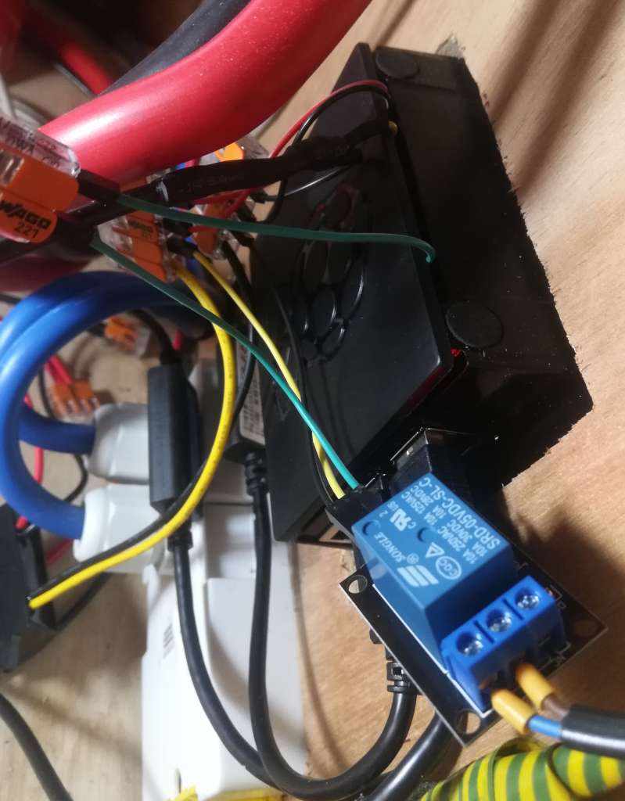
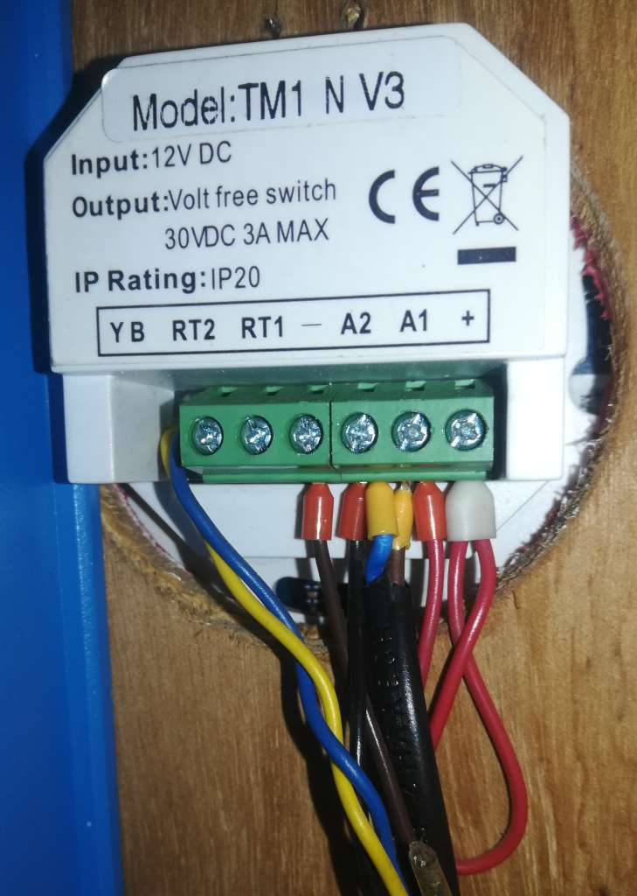
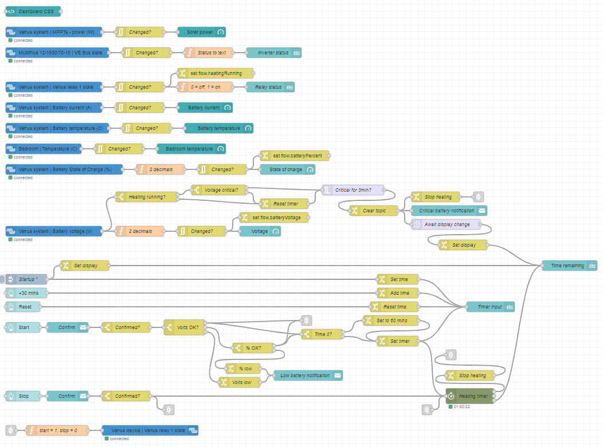

# Run your diesel heater from the internet with Venus OS and Node-RED

This Node-RED flow implements a timer and battery monitor for Webasto or Eberspacher diesel heaters, allowing you to run your boat or van's heating remotely. Never freeze when you get home again!

## You will need

* A Raspberry Pi (or other GX device) running Victron's Venus OS
* A Webasto (or Eberspacher etc) diesel heater
* (Optional but useful) A Victron battery monitor (SmartShunt or BMV)
* A 5V relay module (unless you're using a GX device)
* (Optional) A DS18B20 temperature sensor and 4.7K resistor

## Installation

### Install Venus OS large

If you're already running Venus OS, you'll need to switch to the large version which includes Node-RED. You can do this via the menu system, see the manual [here](https://www.victronenergy.com/live/venus-os:large).

### Connect 5V relay

I picked up a 5V 1-channel relay module for a couple of pounds on eBay. Connect the + pin to the same 5V supply as your Pi, the - pin to the supply's ground, and the S pin to GPIO 21 (pin 40) on the Pi.

Now connect the NC and COM pins to your heating timer. The Webasto timer (Heatmiser TM1) turns on the heater by connecting pins A1 and A2 together, supplying 12V to the black wire on the loom. So, run a wire from each of NC and COM to A1 and A2 (either way round is fine) - see the yellow ferrules in the photo below.

If you're using a GX device instead of a Pi, you don't need a separate relay module. Just connect the NC and COM pins of relay 1 as above.

### (Optional) Install [SetupHelper](https://github.com/kwindrem/SetupHelper), [VenusOS-TemperatureService](https://github.com/Rikkert-RS/VenusOS-TemperatureService) and DS18B20 temperature sensor

I'm not using the temperature sensor to control the heating, as short-cycling it can coke up the combustion chamber. But it's still nice to know how warm the bedroom is! Installing the packages above will allow you to connect a DS18B20 temperature sensor and have it visible in your Node-RED dashboard and on Victron's VRM.

Solder a 4.7K resistor between the positive (red) and signal (yellow) wires of the sensor. Connect the positive wire to the same 5V supply as the Pi, the negative wire to the supply's ground, and the signal wire to GPIO 4 (pin 7) on the Pi. You should now see the temperature appear in the Venus OS menu.

### Import Node-RED flows

Go to Node-RED (https://venus.lan:1881 or https://venus_ip:1881) and import the flow from flow.json. Edit any of the Victron devices as necessary for your system, then deploy.

By default, the heating can't be turned on if the battery voltage or charge percentage is low. If the battery voltage reaches (and stays at) a critical level while running, the heater will turn off automatically. You can adjust the thresholds by editing the nodes "Voltage critical?", "Critical for 3min?", "Volts OK?" and "% OK?".

### Access locally or via VRM

Go to the dashboard at https://venus.lan:1881/ui and try it out!

Turn on the heater by setting a length of time using the "+30 mins" and "Reset" buttons, then press Start. If you don't enter a time, it will default to 1 hour. The heater will stop when the timer runs out, or you can stop it immediately by pressing Stop. You can adjust the time while running by using the "+30 mins" button to set a new timer, and pressing Start to activate it.

You can also access the dashboard remotely by going to your installation on [Victron VRM](https://vrm.victronenergy.com), selecting Venus OS Large in the left hand menu and choosing Node-RED dashboard.

For more information, see my [blog post](https://asdfghjkl.me.uk/blog/remote-webasto).
